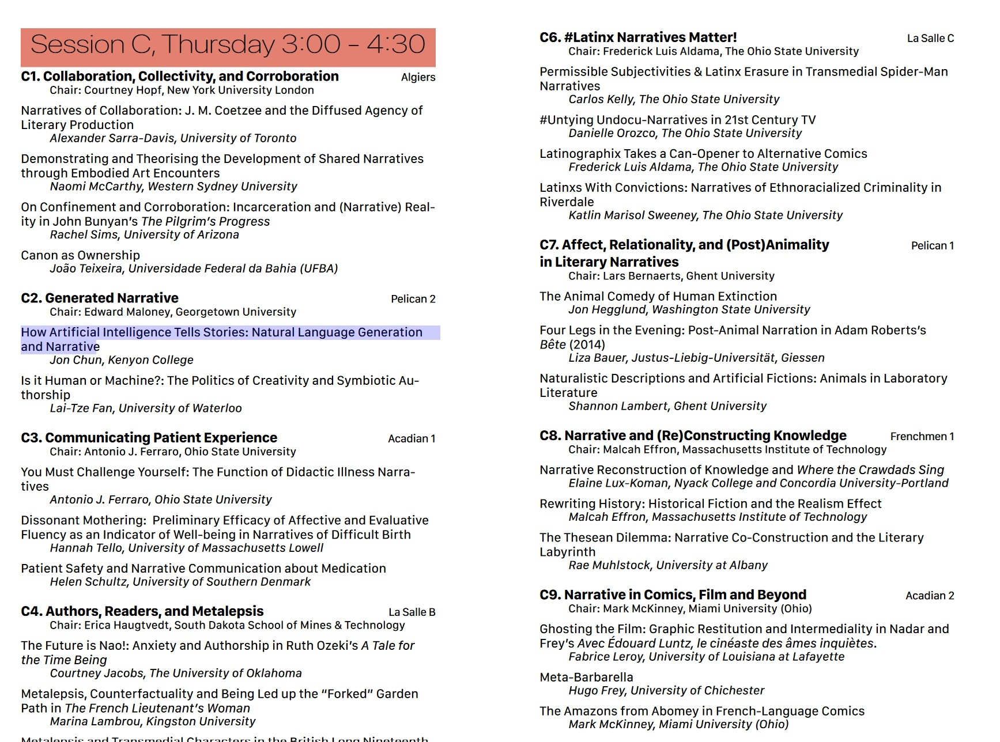
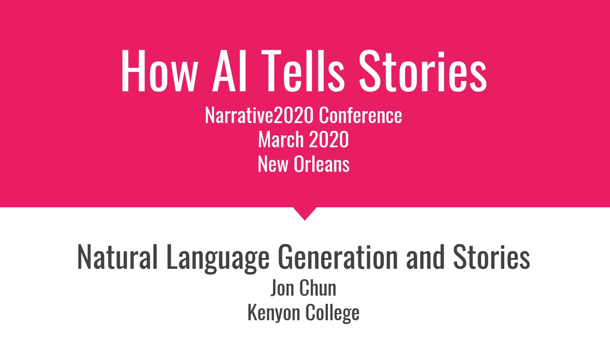

# <b>Narrative2020 Conference Presentation</b>
New Orleans 
March 2020

  
## <b>How AI Tells Stories</b>
---
Jon Chun 
AI Digital Humanities Colab 
Kenyon College</b>
---
<b>Topics:</b>
* AI Narrative
* AI Story Generation
* GPT-2 Fine-Tuning, Comparative Analysis, and  Close Reading
* Natural Language Generation (NLG)

  
## Conference Program
---

  

[Download Program](ConferenceProgram2020.pdf) or goto [Website](https://static1.squarespace.com/static/60999fee5b063770b2d521dc/t/60aeacf2a50f8563ad437715/1622060276425/ConferenceProgram2020.pdf)

  

## Presentation
---

Download Options:
1. [<b>PDF</b> of Presentation](narrative2020_slides_all.pdf)
2. [<b>Powerpoint</b> of Presentation](presentation_how_ai_writes_20200304.pptx)
